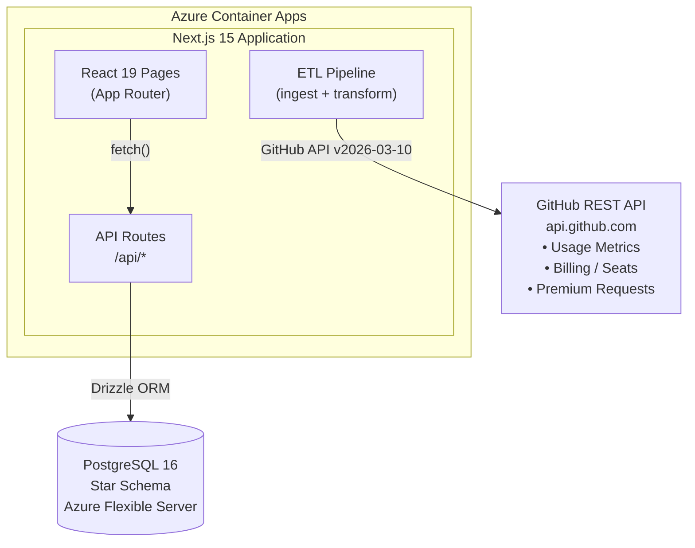
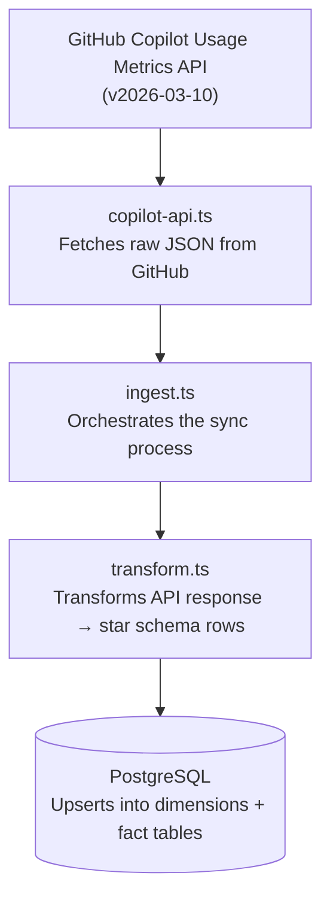
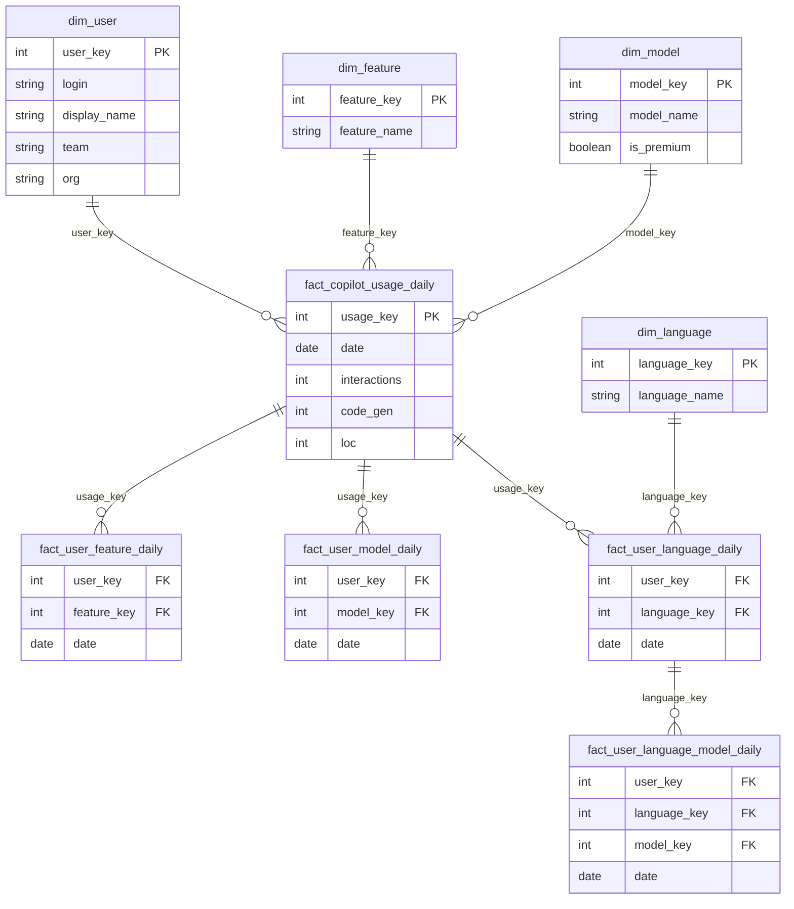
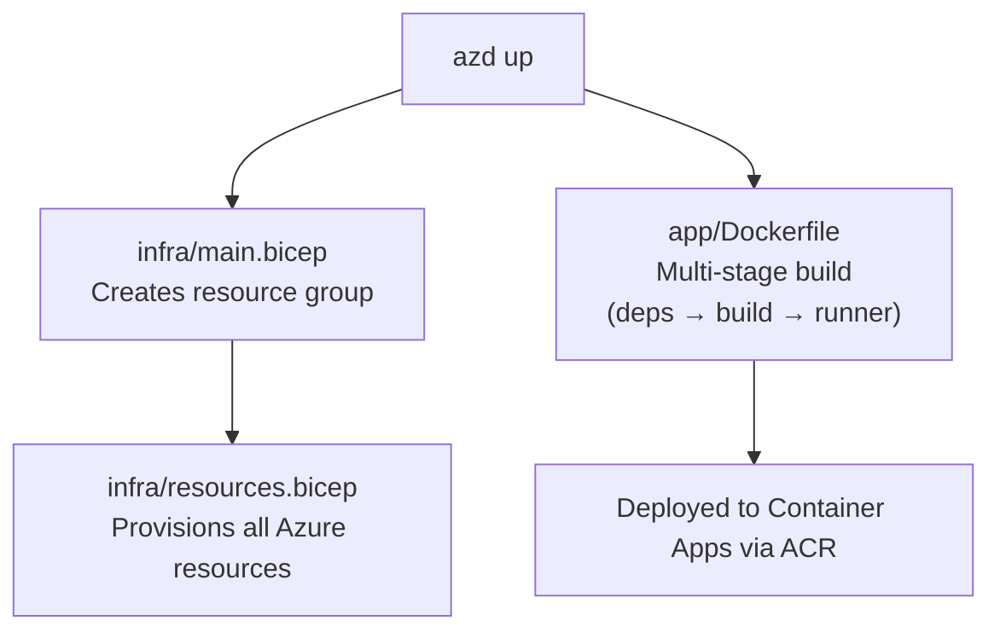
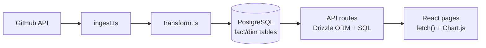
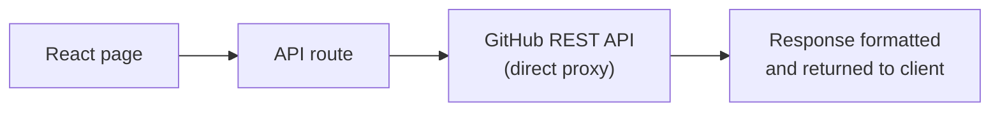

# Architecture

Copilot Insights is an enterprise analytics dashboard for GitHub Copilot usage data. This document describes the system architecture, data flow, and key components.

## System Overview

## Component Architecture

### Frontend (React 19 + Next.js App Router)

All dashboard pages are client components using `"use client"` that fetch data from internal API routes. Chart rendering uses `react-chartjs-2` (Chart.js 4).

| Component | Purpose |
|---|---|
| `components/layout/sidebar.tsx` | Main navigation sidebar |
| `components/layout/report-filters.tsx` | Shared date range picker + searchable user filter |
| `components/layout/breadcrumb.tsx` | Page breadcrumb navigation |
| `components/ui/data-table.tsx` | Sortable, paginated data table |

### API Layer (Next.js Route Handlers)

All API routes live under `app/src/app/api/` and use Zod for request validation.

| Route | Method | Description |
|---|---|---|
| `/api/metrics/dashboard` | GET | Main usage metrics (active users, completions, models, languages) |
| `/api/metrics/code-generation` | GET | LOC breakdown by feature, model, language |
| `/api/metrics/agents` | GET | Agent adoption, acceptance, code generation |
| `/api/metrics/models` | GET | Model catalog with usage stats |
| `/api/metrics/seats` | GET | Live seat data from GitHub Billing API |
| `/api/metrics/premium-requests` | GET | Live premium request data from GitHub API |
| `/api/users` | GET | User-level activity data |
| `/api/filters` | GET | Available filter options (user list) |
| `/api/data-range` | GET | Ingested data date range for banners |
| `/api/ingest` | POST | Trigger data ingest |
| `/api/ingest/stream` | GET | SSE streaming ingest with progress |
| `/api/ingest/upload` | POST | Upload JSON data manually |
| `/api/settings` | GET/POST | Application settings CRUD |
| `/api/settings/sync-history` | GET | Sync history log |
| `/api/settings/sync-interval` | GET/POST | Background sync interval config |
| `/api/auth/verify-admin` | POST | Admin password verification |
| `/api/admin/reset` | POST | Database reset |

### ETL Pipeline

The ingest pipeline runs in two modes:

1. **Background Auto-Sync** — A `setInterval` in `instrumentation.ts` (Next.js `register()` hook) fires on a configurable interval.
2. **Manual Sync** — Triggered from the Settings page via Server-Sent Events for real-time progress.

**Key files:**
- `lib/github/copilot-api.ts` — GitHub API client with pagination and rate limiting
- `lib/etl/ingest.ts` — Main ingest orchestration
- `lib/etl/transform.ts` — Data transformation to star schema format
- `lib/github/resolve-display-names.ts` — Resolves GitHub login → display name mapping

## Database Schema

The database follows a **star schema** design optimized for analytics queries.

### Dimension Tables

| Table | Description |
|---|---|
| `dim_user` | SCD Type 2 user dimension (login, display name, team, org) |
| `dim_feature` | Copilot feature/mode dimension (chat, agent, code_completion, etc.) |
| `dim_model` | AI model dimension (GPT-4, Claude, Gemini, + display name, premium flag) |
| `dim_language` | Programming language dimension |

### Fact Tables

| Table | Description |
|---|---|
| `fact_copilot_usage_daily` | One row per user per day — core metrics (interactions, code gen, LOC, mode flags) |
| `fact_user_feature_daily` | One row per user per feature per day |
| `fact_user_model_daily` | One row per user per model per feature per day |
| `fact_user_language_daily` | One row per user per language per day |
| `fact_user_language_model_daily` | One row per user per language per model per day |

### Supporting Tables

| Table | Description |
|---|---|
| `raw_copilot_usage` | Raw API response stored as JSONB (for code generation report) |
| `ingestion_log` | Sync history with timestamps and status |
| `settings` | Key-value application settings |

### ER Diagram

## Infrastructure (Azure)

Deployed via Azure Developer CLI (`azd`) with Bicep templates.

### Resources

| Resource | SKU | Purpose |
|---|---|---|
| **Container App** | 0.5 vCPU / 1 GiB / scale 0–3 | Hosts the Next.js application |
| **Container App Environment** | — | Managed environment with Log Analytics |
| **PostgreSQL Flexible Server** | B1ms / 32 GB | Relational database |
| **Container Registry** | Basic | Docker image registry |
| **Key Vault** | RBAC | Stores DATABASE_URL, ADMIN_PASSWORD |
| **Application Insights** | — | APM and telemetry |
| **Log Analytics Workspace** | — | Centralized logging |
| **Managed Identity** | User-assigned | RBAC for ACR pull + Key Vault access |

### Deployment Flow

### Security

- All secrets stored in **Azure Key Vault** (not environment variables)
- Container App uses **Managed Identity** for RBAC-based access to ACR and Key Vault
- PostgreSQL firewall allows only Azure services
- Admin settings page protected by password gate
- No public database access

## Data Flow

### Ingested Data (Copilot Usage, Agents, Code Generation)

### Live Data (Seats, Premium Requests)

Seats and Premium Requests pages call GitHub APIs directly on each request (no database caching) to ensure real-time data. These pages display a "Live from GitHub API" data source banner.

## Configuration

Application settings are stored in the `settings` database table and managed through the Settings UI:

| Setting | Description |
|---|---|
| GitHub Token | PAT for API access |
| GitHub Organization | Org slug for API queries |
| Admin Password | Password for settings access |
| Sync Interval | Auto-sync frequency in minutes |

The Settings page has two tabs:
1. **Configuration** — Token, org, password management
2. **Data Sync** — Manual sync trigger, sync history, interval config
